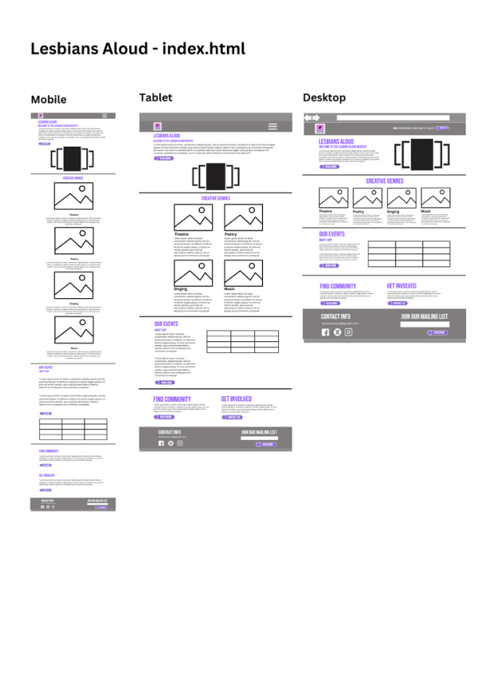
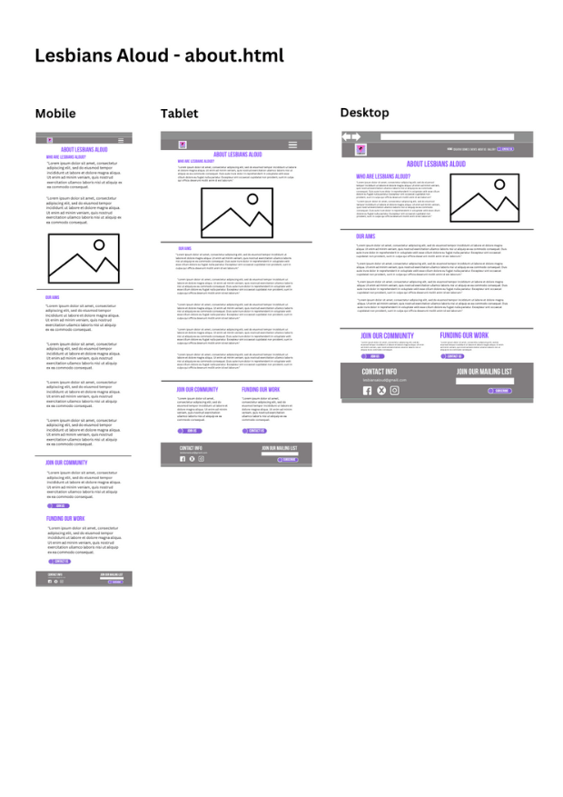
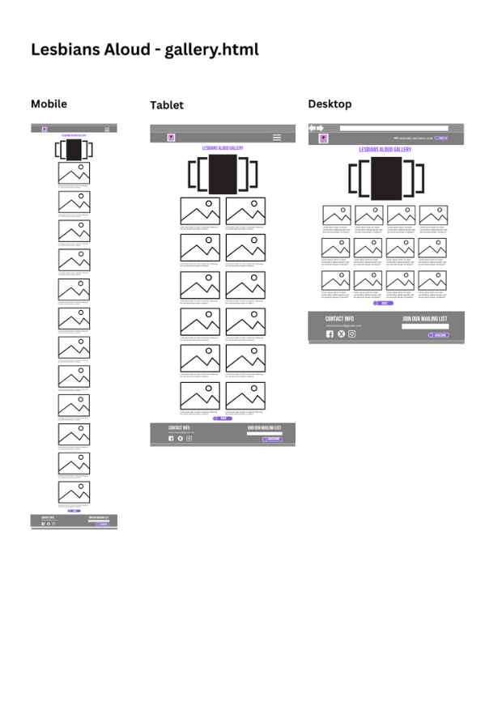
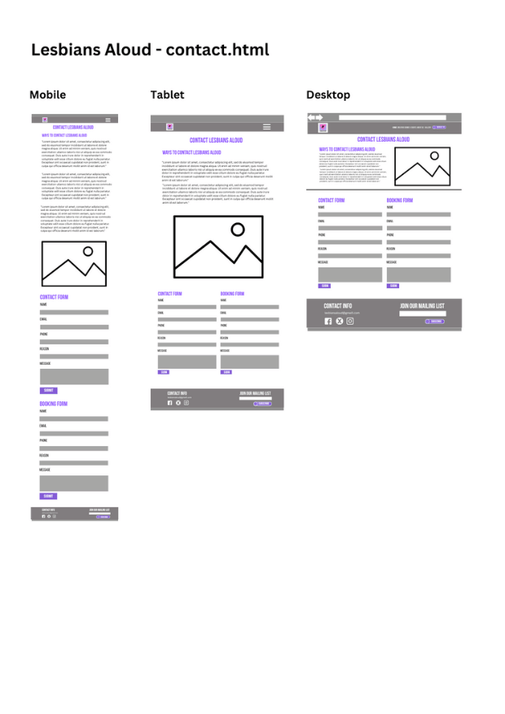
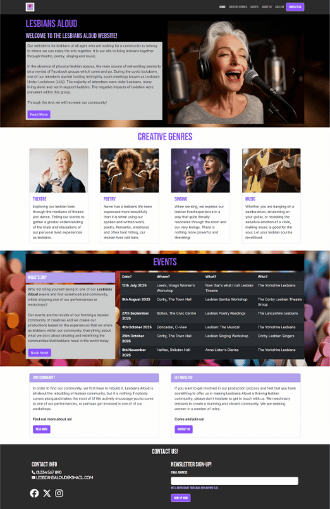
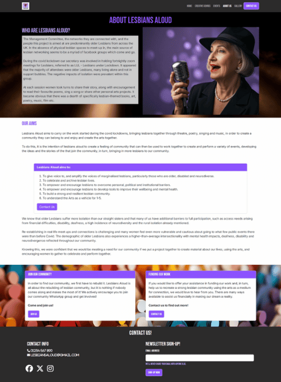
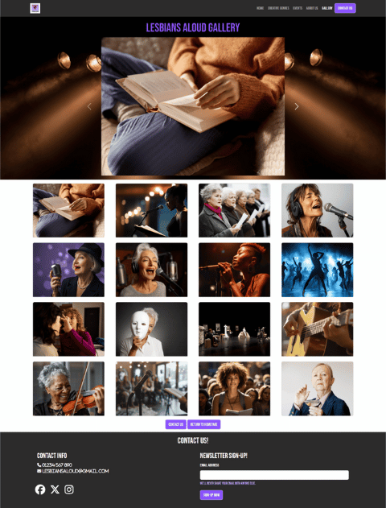
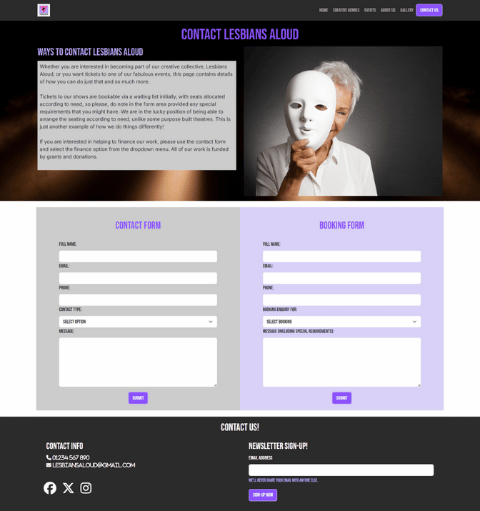
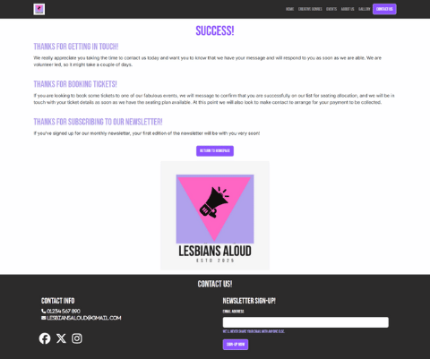

# **Milestone Project One - Lesbians Aloud**

## **Project Description**

The Lesbians Aloud website is essentailly a website for lesbians of all ages who are looking for a community to belong to where they can also enjoy the arts together. Lesbians Aloud aims to bring lesbians together through theatre, poetry, singing and music. This is a real project group that is starting up this year. 

To do this, it is the intention of lesbians aloud to create a feeling of community that can then be used to work together to create and perform a variety of events. Through the creation of the community, the ideas and the stories of the lesbians that join the community, will become the performances and workshops that we pit on. This, in turn, will bring in more lesbians to our community, broadening the scope of our creations and creating a living herstory of lesbian life in the 21st century. 

The aims of the website are

1. To bring together and give voice to, and amplify the voices of, marginalised lesbians, particularly those who are older, disabled and neurodiverse. 
2. To celebrate and archive lesbian lives. 
3. To empower and encourage lesbians to overcome personal, political and institutional barriers. 
4. To empower and encourage lesbians to develop tools to improve their wellbeing and mental health. 
5. To build a strong and resilient lesbian community. 
6. To understand the Arts as a vehicle for 1-5. 

The website is intended to work to attract lesbians to join the community, to perhaps also become participants in the projects, and to increase attendees to our events and, as a result, encourage funding charities and organisations to help us fund further projects.

## **Features**

1. Intuitive and fixed navigation 
2. About us header section on the homepage and a dedicated about us page
3. A creative genres section showing the arts we are currently involved in 
4. An events listing section advising of future events
5. Contact information and social media on footer 
6. A gallery page showing photos of past events 
7. A booking form for a variety of forthcoming events 
8. A contact form with a variety of choices available
9. A newsletter sign-up on the footer 

Given that the website is predominantly aimed at older lesbians, it is important that the text remains readable on all screen sizes and that the navigation is fixed so that it is always available. To ensure this I have left the text larger on smaller screen sizes, where I might have made the text smaller were the website aimed at younger lesbians. I have also increased the contrast on headers with a background colour or image set behind it to ensure that the text remains easy to read for the visually impaired.

## **Project Planning - User Stories**

The projects user stories are partly borrowed from previous course material where they are relevant, but have also been gathered by talking to women involved in this project to ensure that the main user recommendations are met, in the hope that this milestone one project build will be the foundation of the actual website for Lesbians Aloud.

In brackets at the end of each user story title is the designated importance I gave each story in the project planning. I did all the user stories, barr the testimonials as I ran out of time.

### **User Story One - User friendly navigation and responsive design** (Must have)
As an older internet user, I prefer the websites I use to have navigation that makes sense, with a design that is easy on the eye. It also needs to be responsive to different devices, as I like to sometimes use my phone and sometimes my laptop.
- The layout of the navigation is set out in a way that is logical with the flow of the website and is fixed at the top of the page to ensure that it is always available to the user.
- This is consistent when viewed on all device sizes, including when the burger icon is opened on smaller device types.
### **User Story Two - Past event photos** (Must have)
As a potential attendee of your events, it would be useful to see photos of your past events so that I can get an idea of what your events are like and feel confident about attending.
- Photos are added on the homepage in a carousel, as well as having a specific gallery page available.
### **User Story Three - List of events** (Must have)
It would be good to see a list of upcoming events so that I can find some interesting events to attend.
- There is a list of events on the homepage, but at the present time these events are fictional. As and when the site goes live, I would look to add a link to more details about each event as a pop-up when clicked.
### **User Story Four - Contact form** (Must have)
As a lesbian creative, it would be really useful to be able to get in touch and see how I could get involved in the valuable work that you are doing.
- Highlighted on the fixed navigation as a button is a link to the contact page.
- The contact form has many links available as buttons placed all over the website as this is a vital part of the project.
### **User Story Five - Community connection** (Should have)
As an older lesbian looking to re-find community with other lesbians, it would be good if there was a way to get added to a chat group or forum with other lesbians interested in the creative arts.
- There is a section on the about us page that directs lesbians to the contact form and on the contact form there is an option to be added to the WhatsApp chat group. 
- The contact form has many links available as buttons placed all over the website as this is a vital part of the project.
### **User Story Six - Testimonials** (Could have)
It would be a good thing as someone who would be interested in attending the events you put on, to read testimonials from previous attendees so that I can feel confident in buying a ticket and attending your events.
### **User Story Seven - Event organisor contact info** (Must have)
As a potential event attendee, I would like to be able to find contact information for the event organisers so that I can ask questions or get further information on events and accessibility for disabled attendees.
- On the footer there are contact details and links to social media for lesbians to use in order to contact or connect with us. (At the present time, only the email address is active. Obviously the phone number isn't real and the social links are set to open on each individual platforms homepage)
### **User Story Eight - Booking form** (Must have)
As an older lesbian with limited mobility, I would like to be able to book your events online to ensure that I get a seat for the event.
- On the events section of the homepage there is a link to the bookings form.
### **User Story Nine - Newsletter Sign-up** (Should have)
I would like to be able to hear about new events and updates as they are released, so that I can either get involved or attend the event. A Newsletter signup would be ideal to keep me informed.
- On the footer of every page there is a newsletter sign-up form.
### **User Story Ten - Funding Attractiveness** (Must have)
As a person involved in the funding of community events, it would be great if the website was a real show case of the work that you do, offering me an opportunity to contact you directly to discuss possible funding options.
- The entire website is geared up to be attractive to both the end users and to potential funding groups and organisation, in that the ideas of the project are fully explained and shown in an attractive style and layout.

## **Project Planning - Wireframes**

The wireframes were built to see that the important aspects of the user stories were met and that the website would continue to look good on all device sizes. They are not exact replicas of the finished website, as some elements had to change in the real world application of the site. Predominantly, this comment relates to the footer area, where the two elements are stacked rather than side by side.

As this website is aimed at older users, I also chose not to centre all the text on smaller screen sizes, as I beleive this to be something that is more important to younger users. Older users tend to prefer a fixed format, and as such, I have catered to that taste in the actual build of the website.

### **index.html**

### **about.html**

### **gallery.html**

### **Contact.html**

### **success.html**

## **Testing Documentation**

### **Testing process:**

In order to test the website once deployed, I devised the following testing process structure:

1. Check each page for:
    - All links working
    - All forms working
    - Responsive layout on all device sizes

2. Run each completed page through lighthouse to see where there were issues that I could fix with Performance, Accessibility and Best Practices and make alterations were able to.

3. Run CSS stylesheet through the W3C CSS Validator and make corrections were necessary.

4. Run each completed page through the W3 Nu HTML Checker and make corrections were necessary.

5. Check each completed page for consistency of design and correct any differences, including alt images being consistent and detailed for visually impaired users.

6. Check each completed page for empty code lines greater than 1 or two lines and correct any issues.

7. Ensure that the notes were also consistently presented and thorough and correct any issues.

8. Run the CSS stylesheet through the validator to ensure any changes were also consistent with clean CSS code.

9. Run the completed pages through the HTML checker to ensure any changes were consistent with clean and correct coding.

10. Run each completed page back through Lighthouse to ensure scores were improved the best they could be.

### **Testing results:**

1. 
    - All links were checked in the navigation (including the anchors) on all pages and all buttons on the pages were checked - **There was an issue with the anchors from the index page not lining up and the menu staying open. These were resolved adding some Javascript provided in Boardwalk Games and by increassing the padding at the top of the creative-genres and events section**
    - The newsletter sign-up and forms were checked, including incorrectly adding some information to check that the correction prompt popped up on the screen where appropriate, and that I was taken to the success page - **All good**
    - Responsive layouts were checked for all pages on all device sizes - **All good**

2. Each page was passed through Lighthouse and it flagged performance issues with the images overall sizes slowing down load times on pages that are high on numbers of images - I took the images back to Canva and reduced the size of the image and compressed the size of each file. It also mentioned using more up-to-date file types, but I don't have the knowledge or software to acheive this - **Images were reduced in size and compressed and then the new files were uploaded and then committed and pushed to Github**

3. I ran the CSS stylesheet through the W3C CSS Validator and it passed with no errors - **All good**

4. Each page was run throught the W3 Nu HTML Checker and the results were as follows:

    - index.html: 2 open tag page errors were noted in the 'creative-genres' section and the 'footer' section.
    - about.html: No header flagged in 'our-aims' section and an open tag in the 'footer' section.
    - gallery.html: No header flagged in 'photos' section and an open tag in the 'footer' section.
    - contact.html: Duplicate names in the forms were flagged and an open tag in the 'footer' section.
    - success.html: A stray 
 tag was flagged, as well as no header for the logo image section and an open tag in the 'footer' section.
    - **Errors corrected as found and corrected code committed and pushed to Github**

5. Each page was checked for consistency of design and this resulted in changes to the alt text for images, the colour of backgrounds on headers and buttons to improve the contrast, as well as darkening the colour of the navigation bar and footer to improve the contrast on all pages for visually impaired users - **All differences aligned updated code committed and pushed to Github**

6. Each page was checked for empty lines of code and brought inline with best practise of gaps no bigger than one line, at the most two empty lines - **Errors corrected as found and corrected code committed and pushed to Github**

7. Each page was also checked for a consistent approach to the notes, including details and line spacing inline with best practise - **Errors corrected as found and corrected code committed and pushed to Github**

8. I ran the CSS stylesheet through the W3C CSS Validator again after making some changes and it passed with no errors - **All good**

9. Each page was run through the W3 Nu HTML Checker again and each page passed without any errors - **All good**

10. Each page was again run through Lighthouse to check for Performance, Accessibility and Best practises. The results on the second run through were much improved and were as follows:

    - index.html: Performance = 74, Accessibility = 95, Best Practice = 96
    - about.html: Performance = 86, Accessibility = 94, Best Practice = 96
    - gallery.html: Performance = 71, Accessibility = 95, Best Practice = 96
    - contact.html: Performance = 85, Accessibility = 95, Best Practice = 96
    - success.html: Performance = 93, Accessibility = 95, Best Practice = 96

### **Testing conclusions:**

One of the main reasons that the Performance scores on Lighthouse were much lower than the scores for Accessibility and Best Practice is due mainly to the images used and their size and load times as older file types, particularly on pages that are image heavy (the index and gallery pages especially). One of the first red flags on Performance is for not using next-gen file types, such as WebP and AVIF. Other red flag issues are not things that I can control, such as the external use of Bootstrap, Google Fonts and Font Awesome. 

Despite having run out of time on this project, I couldn't help but once more attempted to reduce the file sizes to improve my scores, with some success. Here are the revised scores:

- index.html: Performance = 83, Accessibility = 95, Best Practice = 96
- about.html: Performance = 90, Accessibility = 94, Best Practice = 96
- gallery.html: Performance = 73, Accessibility = 95, Best Practice = 96
- contact.html: Performance = 94, Accessibility = 95, Best Practice = 96
- success.html: Performance = 93, Accessibility = 95, Best Practice = 96

It is now ONLY the image heavy pages (index and gallery) that have scores under 90 for performance.

The errors within the coding were all fixable errors, and I suspect going forward, that I will be better able to spot these errors as they are made, but actually, given that this is the first website that I have built writing the majority of the code myself, I am pretty happy that the errors were pretty low in numbers. No more than 2 or 3 per page and my CSS passed both times, first time.

The line spacing issues and consistency of the code were an easy fix, and again, I suspect that they will occur less and less as I move forward with my studies.

## **Finished website images**

### **index.html**

**User stories this covers**
1. User Story One - User friendly navigation and responsive design
2. User Story Two - Past event photos
3. User Story Three - List of events
4. User Story Four - Contact form (link)
5. User Story Five - Community connection
6. User Story Seven - Event organisor contact info
7. User Story Eight - Booking form (link)
8. User Story Nine - Newsletter Sign-up
9. User Story Ten - Funding Attractiveness

### **about.html**

**User stories this covers**
1. User Story One - User friendly navigation and responsive design
2. User Story Two - Past event photos
3. User Story Four - Contact form (link)
4. User Story Five - Community connection
5. User Story Seven - Event organisor contact info
6. User Story Eight - Booking form (link)
7. User Story Nine - Newsletter Sign-up
8. User Story Ten - Funding Attractiveness

### **gallery.html**

**User stories this covers**
1. User Story One - User friendly navigation and responsive design
2. User Story Two - Past event photos
3. User Story Four - Contact form (link)
4. User Story Seven - Event organisor contact info
5. User Story Nine - Newsletter Sign-up
6. User Story Ten - Funding Attractiveness

### **contact.html**

**User stories this covers**
1. User Story One - User friendly navigation and responsive design
2. User Story Four - Contact form
3. User Story Five - Community connection
4. User Story Seven - Event organisor contact info
5. User Story Eight - Booking form
6. User Story Nine - Newsletter Sign-up
7. User Story Ten - Funding Attractiveness

### **success.html**

**User stories this covers**
1. User Story One - User friendly navigation and responsive design
2. User Story Four - Contact form (link)
3. User Story Seven - Event organisor contact info
4. User Story Nine - Newsletter Sign-up

## **Deployment**

The site was deployed via Github pages and has immediately worked as expected. No changes were required after deployment and the commits were pushed and checked on the deployed site on each occassion.

## **How to view the project**

The website has been created using Visual Studio Code and Github. In order to view the completed website, please click the link below.

- [View the deployed website](https://di-winn.github.io/milestone-one-lesbians-aloud/)

## **Credits**

- The code for the social media icon animations were taken from Font Awesome. 
- The favicon is designed using Canva and produced for use over multiple browsers via favicon.io
- Many of the layout elements are provided by Bootstrap and are noted where applicable. 
- The fonts used are from Google Fonts.
- The high-quality images were taken from Adobe Stock as part of a free trial of their services.
- Canva was used to reduce the size of the stock images and compress them to improve the websites performance. 